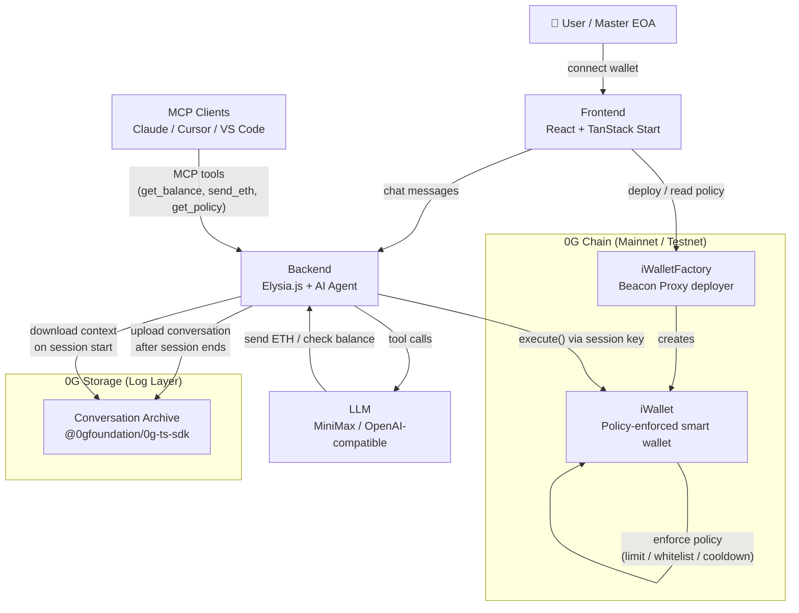

# iWallet

AI-Native Smart Wallet with On-Chain Policy Rules — built on the **0G Blockchain**.

iWallet creates deterministic sub-wallets derived from your master wallet, each controlled by an AI agent. On-chain policy rules (daily spend limits, contract whitelists, cooldowns) act as guardrails — even a misbehaving agent cannot exceed its boundaries. Agent conversations are permanently stored on **0G decentralized storage**.

## Live Demo

- **Frontend:** [https://wallet.goon4.site](https://wallet.goon4.site)
- **Backend/MCP:** [https://be-wallet.goon4.site](https://be-wallet.goon4.site)
- **Contract (Mainnet):** [0x08a7Ea416AF2b8DD4614aa6A314ee7c96F8aA68d](https://chainscan.0g.ai/address/0x08a7Ea416AF2b8DD4614aa6A314ee7c96F8aA68d)
- **Contract (Testnet):** [0xCF1f2860BA28aD3c7BCfCc29ab34c2f70D64F4ca](https://chainscan-galileo.0g.ai/address/0xCF1f2860BA28aD3c7BCfCc29ab34c2f70D64F4ca)

## Key Features

- **On-Chain Policy Enforcement** — daily limits, allowed contracts, cooldowns enforced by smart contracts
- **0G Storage Integration** — agent conversations permanently archived on decentralized storage
- **AI Agent with Tool Calling** — check balances, send ETH, read policy via LLM
- **MCP Protocol** — any MCP-compatible client (Claude, Cursor, VS Code) can control the wallet
- **Deterministic Sub-Wallets** — derived from master wallet signature, no new seed phrases

## System Architecture



### Flow Description

1. **User connects** their master EOA wallet via the frontend
2. **iWalletFactory** deploys a deterministic `iWallet` contract for the user on 0G Chain
3. **User sets policy** (daily ETH limit, contract whitelist, cooldown, expiry) stored on-chain in `iWallet`
4. **AI agent** receives chat messages, calls LLM with tool definitions, and executes tools (send ETH, check balance, read policy)
5. **Every agent transaction** goes through `iWallet.execute()` — the contract enforces policy rules atomically before forwarding the call. Violations revert on-chain.
6. **After each session**, the backend uploads the full conversation to **0G Storage** via `@0gfoundation/0g-ts-sdk`, storing the Merkle root hash in a local index
7. **On next session start**, the backend fetches the latest conversation context from 0G Storage and injects it into the agent's system prompt as persistent memory

## 0G Component Usage

### 0G Chain

**SDK/API:** Direct EVM RPC via `viem` + Hardhat deployment  
**Contracts deployed:**
- `iWalletFactory` — UUPS-upgradeable factory using OpenZeppelin Beacon Proxy pattern
- `iWallet` — per-user smart wallet with per-session policy enforcement

**Problem it solves:** Off-chain guardrails (rate limiters, server-side checks) can be bypassed by prompt injection or a compromised backend. By enforcing policy rules inside `iWallet.execute()` on 0G Chain, the constraints are cryptographically guaranteed — no AI agent, no matter how compromised, can exceed its daily spend limit or interact with non-whitelisted contracts.

### 0G Storage (Log Layer)

**SDK:** `@0gfoundation/0g-ts-sdk` — `Indexer` + `MemData`  
**Endpoints:**
- Upload: `Indexer.upload(memData, rpc, signer)`
- Download: `Indexer.download(rootHash, path)`
- Indexer: `https://indexer-storage-turbo.0g.ai` (mainnet) / `https://indexer-storage-testnet-turbo.0g.ai` (testnet)

**Problem it solves:** AI agents are stateless by default — every session starts from zero with no memory of past interactions. By archiving conversation history to 0G Storage after each session and loading it back on the next, iWallet gives agents **permanent, decentralized memory** without relying on any centralized database.

## Project Structure

```
iwallet/
├── packages/
│   ├── contract/       # Solidity smart contracts (Hardhat v3)
│   ├── backend/        # Elysia.js API + AI agent + 0G Storage
│   ├── frontend/       # React + TanStack Start + Tailwind
│   ├── chains/         # Shared chain definitions & ABIs
│   └── tokens/         # Token registry
├── scripts/            # Deploy & E2E scripts
└── package.json        # Bun workspace root
```

## Quick Start

### Prerequisites

- [Bun](https://bun.sh) v1.2+
- [Node.js](https://nodejs.org) v22 LTS (required by Hardhat)
- MetaMask or any EVM wallet

### Install & Run

```bash
# Install all dependencies
bun install

# Start backend (port 3001)
cd packages/backend
bun run dev

# Start frontend (port 3000)
cd packages/frontend
bun run dev
```

### Wallet Setup

1. Add **0G Galileo Testnet** to MetaMask:
   - RPC: `https://evmrpc-testnet.0g.ai`
   - Chain ID: `16602`
   - Symbol: `0G`
2. Get testnet tokens: [faucet.0g.ai](https://faucet.0g.ai)
3. Connect wallet on the app

## Contract Deployment

### Deploy to Testnet (0G Galileo)

```bash
cd packages/contract

# 1. Copy env and set your deployer private key
cp .env.example .env
# Edit .env: set DEPLOYER_PRIVATE_KEY=0x...

# 2. Compile
bunx hardhat compile

# 3. Deploy factory + implementation
bunx hardhat run scripts/deploy.ts --network galileo

# 4. Run tests
bunx hardhat test
```

### Deploy to Mainnet (0G Newton)

```bash
bunx hardhat run scripts/deploy.ts --network mainnet
```

Deployed addresses are saved to `deployments.testnet.json` / `deployments.mainnet.json` at the repo root.

## Environment Variables

### Backend (`packages/backend/.env.local`)

```env
PORT=3001
CORS_ORIGIN=http://localhost:3000

# LLM (MiniMax or any OpenAI-compatible)
LLM_API_KEY=sk-...
LLM_BASE_URL=https://api.minimax.io/v1
LLM_MODEL=MiniMax-M2.7

# 0G Storage (enables persistent agent memory)
ZG_PRIVATE_KEY=0x...
ZG_RPC=https://evmrpc-testnet.0g.ai
ZG_INDEXER=https://indexer-storage-testnet-turbo.0g.ai
```

### Frontend (`packages/frontend/.env.local`)

```env
VITE_BACKEND_URL=http://localhost:3001
VITE_REOWN_PROJECT_ID=...      # Optional, for WalletConnect
```

## Usage Flow

1. **Connect** — Connect your wallet on the landing page
2. **Policy** — Go to `/policy`, configure rules (daily limit, allowed contracts, cooldown, expiry)
3. **Fund** — Send 0G to your iWallet address + session key for gas
4. **Agent** — Go to `/agent`, start a chat session, interact with the AI agent
5. **MCP** — Go to `/mcp` for instructions to connect Claude, Cursor, or any MCP client

## Smart Contracts

| Contract | Description |
|---|---|
| `iWallet.sol` | Agent-bounded smart wallet with per-session policy enforcement |
| `iWalletFactory.sol` | UUPS-upgradeable factory + beacon proxy deployer |

```bash
# Compile
cd packages/contract && bunx hardhat compile

# Test
cd packages/contract && bunx hardhat test
```

## Tech Stack

- **Contracts:** Solidity 0.8.28, Hardhat v3, OpenZeppelin (UUPS + Beacon upgradeable)
- **Backend:** Bun, Elysia.js, LLM (MiniMax or any OpenAI-compatible), viem, 0G Storage SDK
- **Frontend:** React 19, TanStack Start, Tailwind v4, wagmi v3, Reown AppKit, Three.js
- **Protocol:** MCP (Model Context Protocol) for AI agent interoperability
- **Storage:** 0G Storage (Log layer for immutable conversation archival)

## License

MIT
